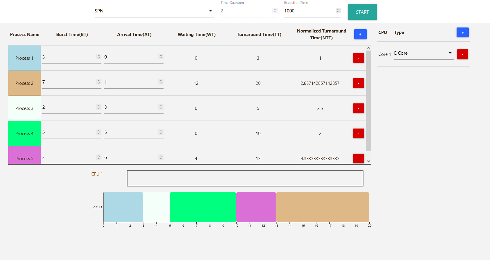

# OS scheduling simulator

OS 프로세스 스케쥴러 시뮬레이터입니다. FCFS, RR, SPN, SRTN, HRRN, Custom을 지원합니다.

- 넣어야 하는 값은 다음과 같습니다(Inputs).
  - Number of process
  - Number of processor
  - Arrival Time of process
  - Burst Time of process
  - Execution Time(default: 1000ms)
- 출력되는 값은 다음과 같습니다(Outputs).
  - process Gantt Chart(x: time, y: processor)
  - Waiting Time of process
  - Turnaround Time of process
  - Normalized Turnaround Time of process
  - Power Consumption of processor(추가 예정)
- 시스템 설정은 다음과 같습니다.
  - E core: 1 Work/second, 1 Watt/second
  - P core: 2 Work/second, 3 Watt/second
  - 0.1W
- 
- 

- Custom?
  - 추가 예정
- Stack
  - svelte
  - typescript
  - Xstate
  - d3
  - materializecss